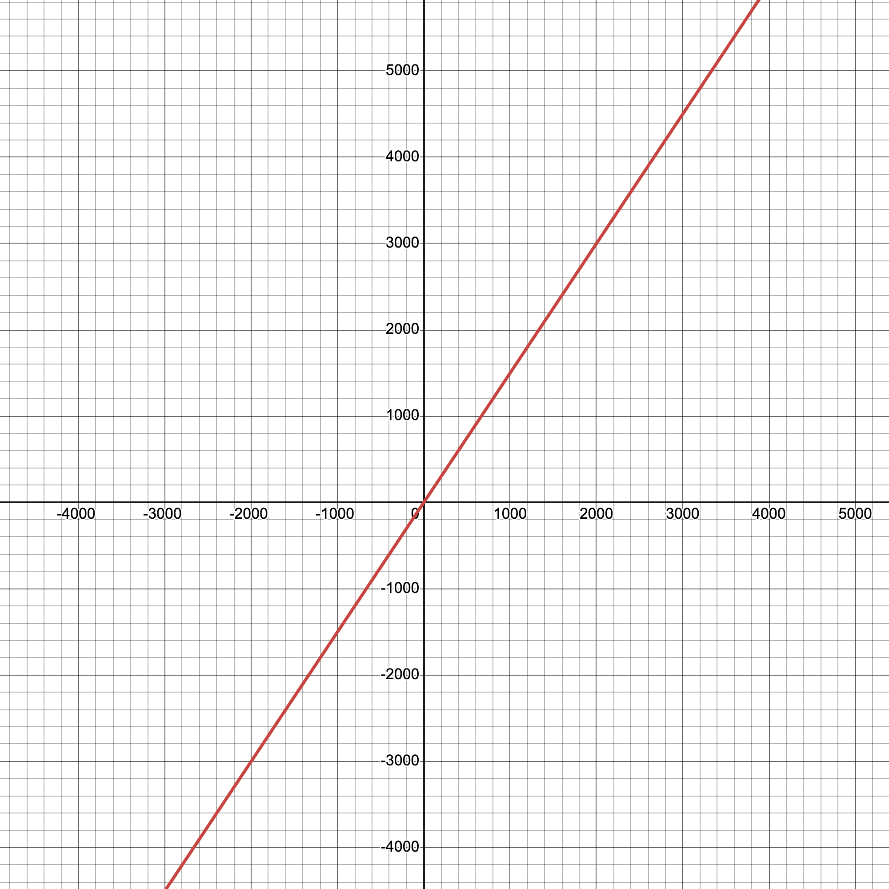

# BondingFi


**ERC-20 continuous tokens based on multiple bonding curve formulas.**

## What is a Continuous Token?

Continuous tokens are a type of token where their price is managed by a bonding curve formula. Their supply is unlimited
and the price is deterministically and continuously calculated meaning that the buy and sell prices increase and
decrease based on the amount of tokens being in circulation. Furthermore, tokens can be purchased or sold
instantaneously due to the bonding curve formula which acts as an automated market maker (AMM).

# Available curves

## Linear Curve

A Linear Bonding Curve is a curve that follows a linear formula, where the price of the token increases in direct
proportion to the number of tokens sold.

Let's see an example of a linear curve graph following the next formula:

$f(x) = b*x + a$

where:

$b$ - the slope (defining how steep the line is) \
$a$ - the initial price

Example:

$f(x) = 1.5*x + 0.003$

this linear curve has the following [graph](https://www.desmos.com/calculator/iwm6tiuxz4):



## Install

Install the submodules using Forge:

```bash
forge install
```

## Similar efforts

-   [Ratimon/bonding-curves](https://github.com/Ratimon/bonding-curves)
-   [lsaether/bonding-curves](https://github.com/lsaether/bonding-curves)
